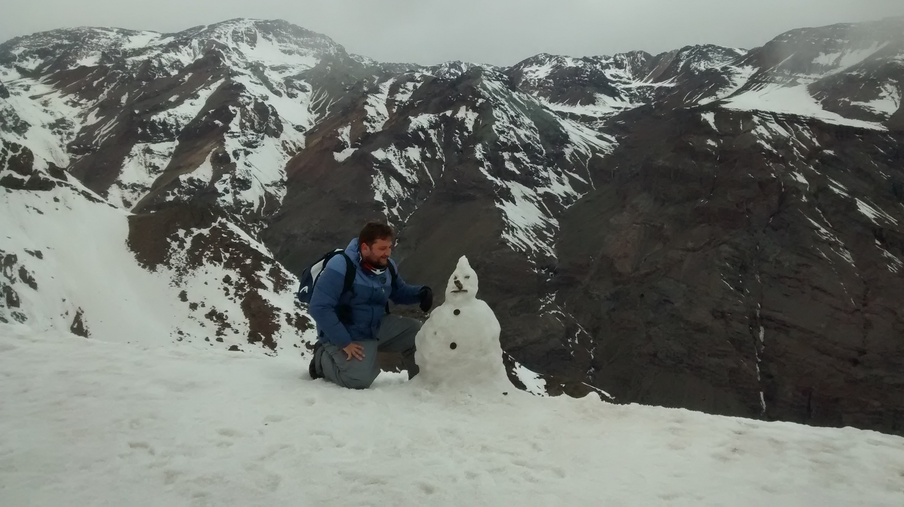

```{r setup , include=FALSE}
knitr::opts_chunk$set(echo = TRUE, 
                      size = "footnotesize",
                      comment = NA,
                      warning = FALSE,
                      message = FALSE,
                      fig.align = "center",
                      fig.width = 8, 
                      fig.height = 4, 
                      fig.show = "hold",
                      fig.path = "Figuras/",
                      fig.pos = "!htb",
                      background = "#E6E6FA",
                      dev = c("png",'pdf'),
                      res=300,
                      dpi = 300,
                      cache = TRUE)

```


[^1]: Algumas lembranças e lugares por onde passei. Caso encontre erros, queira fazer comentários, ou trocar uma ideia sobre o artigo, por favor, me escreva: omarcnpereiraead@gmail.com

# Fotos

## Bahia

{width=100%} 

{width=100%}

{width=100%}

## Chile

{width=100%} 

{width=100%} 

{width=100%} 

{width=100%} 

{width=100%} 

{width=100%} 

{width=100%} 

{width=100%} 

{width=100%} 

{width=100%} 

{width=100%} 

{width=100%} 


## Espanha


{width=100%}

{width=100%}

{width=100%}


## Foz do Iguaçu


{width=100%}

## Porto São José 

{width=100%}

{width=100%}

## Portugal

{width=100%}

<!-- {alt="avatar" style="zoom:70%;transform:rotate(90deg)"} -->


{width=100%}


{width=100%}


{width=100%}

{width=100%}

## Roma

{width=100%}

{width=100%}
