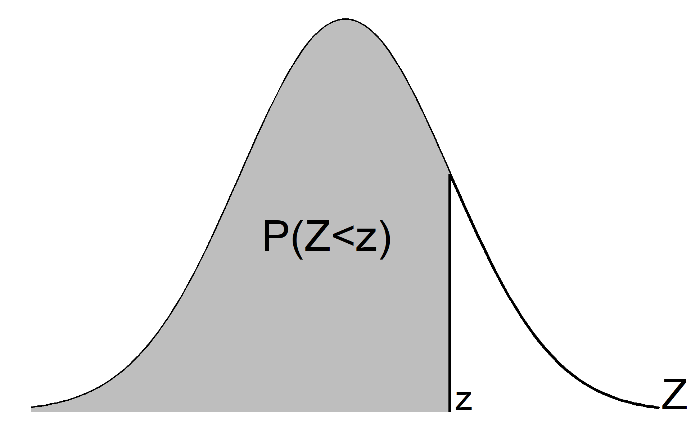
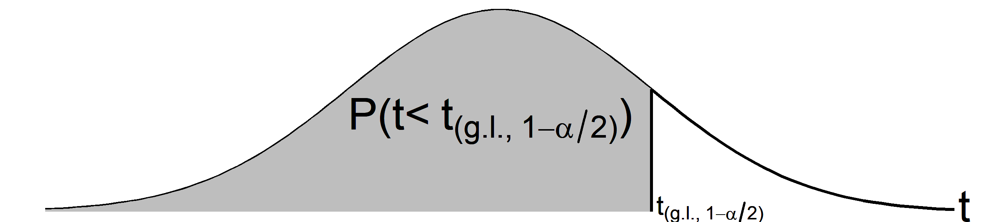
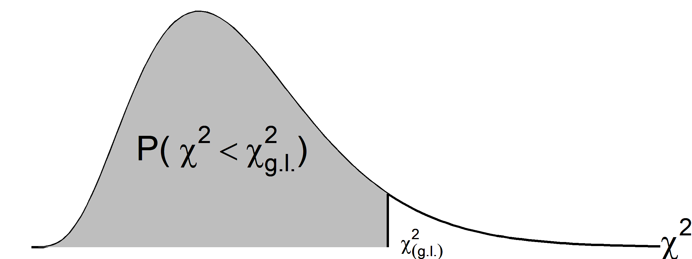

[^1]: Este é um arquivo com tabelas úteis. Caso encontre erros, queira fazer comentários, ou trocar uma ideia sobre o artigo, por favor, me escreva: omarcnpereiraead@gmail.com

# Distribuição Normal Padrão

| z   |   0.00   |   0.01   |   0.02   |   0.03   |   0.04   |   0.05   |   0.06   |   0.07   |   0.08   |   0.09   |
|-----|:--------:|:--------:|:--------:|:--------:|:--------:|:--------:|:--------:|:--------:|:--------:|:--------:|
| 0.0 | 0.5 |  0.504 |  0.508 |  0.512 |  0.516 |  0.5199 |  0.5239 |  0.5279 |  0.5319 | 0.5359 |
0.1 |  0.5398  |  0.5438  |  0.5478  |  0.5517  |  0.5557  |  0.5596  |  0.5636  |  0.5675  |  0.5714  |  0.5753  
0.2 |  0.5793  |  0.5832  |  0.5871  |  0.591  |  0.5948  |  0.5987  |  0.6026  |  0.6064  |  0.6103  |  0.6141  
0.3 |  0.6179  |  0.6217  |  0.6255  |  0.6293  |  0.6331  |  0.6368  |  0.6406  |  0.6443  |  0.648  |  0.6517  
0.4 |  0.6554  |  0.6591  |  0.6628  |  0.6664  |  0.67  |  0.6736  |  0.6772  |  0.6808  |  0.6844  |  0.6879  
0.5 |  0.6915  |  0.695  |  0.6985  |  0.7019  |  0.7054  |  0.7088  |  0.7123  |  0.7157  |  0.719  |  0.7224  
0.6 |  0.7257  |  0.7291  |  0.7324  |  0.7357  |  0.7389  |  0.7422  |  0.7454  |  0.7486  |  0.7517  |  0.7549  
0.7 |  0.758  |  0.7611  |  0.7642  |  0.7673  |  0.7704  |  0.7734  |  0.7764  |  0.7794  |  0.7823  |  0.7852  
0.8 |  0.7881  |  0.791  |  0.7939  |  0.7967  |  0.7995  |  0.8023  |  0.8051  |  0.8078  |  0.8106  |  0.8133  
0.9 |  0.8159  |  0.8186  |  0.8212  |  0.8238  |  0.8264  |  0.8289  |  0.8315  |  0.834  |  0.8365  |  0.8389  
1.0 |  0.8413  |  0.8438  |  0.8461  |  0.8485  |  0.8508  |  0.8531  |  0.8554  |  0.8577  |  0.8599  |  0.8621  
1.1 |  0.8643  |  0.8665  |  0.8686  |  0.8708  |  0.8729  |  0.8749  |  0.877  |  0.879  |  0.881  |  0.883  
1.2 |  0.8849  |  0.8869  |  0.8888  |  0.8907  |  0.8925  |  0.8944  |  0.8962  |  0.898  |  0.8997  |  0.9015  
1.3 |  0.9032  |  0.9049  |  0.9066  |  0.9082  |  0.9099  |  0.9115  |  0.9131  |  0.9147  |  0.9162  |  0.9177  
1.4 |  0.9192  |  0.9207  |  0.9222  |  0.9236  |  0.9251  |  0.9265  |  0.9279  |  0.9292  |  0.9306  |  0.9319  
1.5 |  0.9332  |  0.9345  |  0.9357  |  0.937  |  0.9382  |  0.9394  |  0.9406  |  0.9418  |  0.9429  |  0.9441  
1.6 |  0.9452  |  0.9463  |  0.9474  |  0.9484  |  0.9495  |  0.9505  |  0.9515  |  0.9525  |  0.9535  |  0.9545  
1.7 |  0.9554  |  0.9564  |  0.9573  |  0.9582  |  0.9591  |  0.9599  |  0.9608  |  0.9616  |  0.9625  |  0.9633  
1.8 |  0.9641  |  0.9649  |  0.9656  |  0.9664  |  0.9671  |  0.9678  |  0.9686  |  0.9693  |  0.9699  |  0.9706  
1.9 |  0.9713  |  0.9719  |  0.9726  |  0.9732  |  0.9738  |  0.9744  |  0.975  |  0.9756  |  0.9761  |  0.9767  
2.0 |  0.9772  |  0.9778  |  0.9783  |  0.9788  |  0.9793  |  0.9798  |  0.9803  |  0.9808  |  0.9812  |  0.9817  
2.1 |  0.9821  |  0.9826  |  0.983  |  0.9834  |  0.9838  |  0.9842  |  0.9846  |  0.985  |  0.9854  |  0.9857  
2.2 |  0.9861  |  0.9864  |  0.9868  |  0.9871  |  0.9875  |  0.9878  |  0.9881  |  0.9884  |  0.9887  |  0.989  
2.3 |  0.9893  |  0.9896  |  0.9898  |  0.9901  |  0.9904  |  0.9906  |  0.9909  |  0.9911  |  0.9913  |  0.9916  
2.4 |  0.9918  |  0.992  |  0.9922  |  0.9925  |  0.9927  |  0.9929  |  0.9931  |  0.9932  |  0.9934  |  0.9936  
2.5 |  0.9938  |  0.994  |  0.9941  |  0.9943  |  0.9945  |  0.9946  |  0.9948  |  0.9949  |  0.9951  |  0.9952  
2.6 |  0.9953  |  0.9955  |  0.9956  |  0.9957  |  0.9959  |  0.996  |  0.9961  |  0.9962  |  0.9963  |  0.9964  
2.7 |  0.9965  |  0.9966  |  0.9967  |  0.9968  |  0.9969  |  0.997  |  0.9971  |  0.9972  |  0.9973  |  0.9974  
2.8 |  0.9974  |  0.9975  |  0.9976  |  0.9977  |  0.9977  |  0.9978  |  0.9979  |  0.9979  |  0.998  |  0.9981  
2.9 |  0.9981  |  0.9982  |  0.9982  |  0.9983  |  0.9984  |  0.9984  |  0.9985  |  0.9985  |  0.9986  |  0.9986  
3.0 |  0.9987  |  0.9987  |  0.9987  |  0.9988  |  0.9988  |  0.9989  |  0.9989  |  0.9989  |  0.999  |  0.999  
3.1 |  0.999  |  0.9991  |  0.9991  |  0.9991  |  0.9992  |  0.9992  |  0.9992  |  0.9992  |  0.9993  |  0.999  
3.2 |  0.9993  |  0.9993  |  0.9994  |  0.9994  |  0.9994  |  0.9994  |  0.9994  |  0.9995  |  0.9995  |  0.9995  
3.3 |  0.9995  |  0.9995  |  0.9995  |  0.9996  |  0.9996  |  0.9996  |  0.9996  |  0.9996  |  0.9996  |  0.9997  
3.4 |  0.9997  |  0.9997  |  0.9997  |  0.9997  |  0.9997  |  0.9997  |  0.9997  |  0.9997  |  0.9997  |  0.9998  
3.5 |  0.9998  |  0.9998  |  0.9998  |  0.9998  |  0.9998  |  0.9998  |  0.9998  |  0.9998  |  0.9998  |  0.9998  
3.6 |  0.9998  |  0.9998  |  0.9999  |  0.9999  |  0.9999  |  0.9999  |  0.9999  |  0.9999  |  0.9999  |  0.9999  
3.7 |  0.9999  |  0.9999  |  0.9999  |  0.9999  |  0.9999  |  0.9999  |  0.9999  |  0.9999  |  0.9999  |  0.9999  
3.8 |  0.9999  |  0.9999  |  0.9999  |  0.9999  |  0.9999  |  0.9999  |  0.9999  |  0.9999  |  0.9999  |  0.9999  
3.9 |  1  |  1  |  1  |  1  |  1  |  1  |  1  |  1  |  1  |  1

Se preferir, pode baixar a Tabela da distribuição Normal Padrão  [aqui](https://github.com/OmarEAD/Website/blob/main/TabelasPDF/TNormPad.pdf).

# Distribuição $t$ de Student

<!-- \begin{center} -->
<!-- Os valores tabelados correspondem aos pontos $x$ tais que $P(t_{g.l.} \leq x)$. -->
<!-- \end{center} -->

| g.l.   |   0.900   |   0.950   |   0.975   |   0.995   |
|-----|:--------:|:--------:|:--------:|:--------:|
| 1 |  3.078 |  6.314 |  12.706 | 63.657 |
| 2 |  1.886  |  2.92  |  4.303  |  9.925  
| 3 |  1.638  |  2.353  |  3.182  |  5.841
| 4 |  1.533  |  2.132  |  2.776  |  4.604
| 5 |  1.476  |  2.015  |  2.571  |  4.032
| 6 |  1.44  |  1.943  |  2.447  |  3.707
| 7 |  1.415  |  1.895  |  2.365  |  3.499
| 8 |  1.397  |  1.86  |  2.306  |  3.355
| 9 |  1.383  |  1.833  |  2.262  |  3.25
| 10 |  1.372  |  1.812  |  2.228  |  3.169
| 11 |  1.363  |  1.796  |  2.201  |  3.106
| 12 |  1.356  |  1.782  |  2.179  |  3.055
| 13 |  1.35  |  1.771  |  2.16  |  3.012
| 14 |  1.345  |  1.761  |  2.145  |  2.977
| 15 |  1.341  |  1.753  |  2.131  |  2.947
| 16 |  1.337  |  1.746  |  2.12  |  2.921
| 17 |  1.333  |  1.74  |  2.11  |  2.898
| 18 |  1.33  |  1.734  |  2.101  |  2.878
| 19 |  1.328  |  1.729  |  2.093  |  2.861
| 20 |  1.325  |  1.725  |  2.086  |  2.845
| 21 |  1.323  |  1.721  |  2.08  |  2.831
| 22 |  1.321  |  1.717  |  2.074  |  2.819
| 23 |  1.319  |  1.714  |  2.069  |  2.807
| 24 |  1.318  |  1.711  |  2.064  |  2.797
| 25 |  1.316  |  1.708  |  2.06  |  2.787
| 26 |  1.315  |  1.706  |  2.056  |  2.779
| 27 |  1.314  |  1.703  |  2.052  |  2.771
| 28 |  1.313  |  1.701  |  2.048  |  2.763
| 29 |  1.311  |  1.699  |  2.045  |  2.756
| 30 |  1.31  |  1.697  |  2.042  |  2.75
| 40 |  1.303  |  1.684  |  2.021  |  2.704
| 60 |  1.296  |  1.671  |  2  |  2.66
| 120 |  1.289  |  1.658  |  1.98  |  2.617
| $\infty$ |  1.282  |  1.645  |  1.96  |  2.576

Se preferir, pode baixar a Tabela da distribuição $t$ de Student  [aqui](https://github.com/OmarEAD/Website/blob/main/TabelasPDF/tStudent.pdf).

# Distribuição Qui-Quadrado

| g.l.   |   0.005   |   0.010   |   0.025   |   0.050   |   0.100   |   0.250   |   0.500   |   0.750   |   0.900   |   0.950   |   0.975   |   0.990   |   0.995   |
|-----|:--------:|:--------:|:--------:|:--------:|:--------:|:--------:|:--------:|:--------:|:--------:|:--------:|:--------:|:--------:|:--------:|
| 1 | 0 |  0 |  0.001 |  0.004 |  0.016 |  0.102 |  0.455 |  1.323 |  2.706 |  3.841 |  5.024 |  6.635 | 7.879 |
2 |  0.01  |  0.02  |  0.051  |  0.103  |  0.211 |  0.575 |  1.386 |  2.773  |  4.605  |  5.991  |  7.378  |  9.21  |  10.597  
3 |  0.072  |  0.115  |  0.216  |  0.352  |  0.584 |  1.213 |  2.366 |  4.108  |  6.251  |  7.815  |  9.348  |  11.345  |  12.838  
4 |  0.207  |  0.297 |  0.484 |  0.711 |  1.064  |  1.923  |  3.357  |  5.385  |  7.779  |  9.488 |  11.143 |  13.277  |  14.86
5 |  0.412  |  0.554  |  0.831  |  1.145  |  1.61  |  2.675 |  4.351 |  6.626 |  9.236  |  11.07  |  12.833  |  15.086  |  16.75  
6 |  0.676  |  0.872  |  1.237  |  1.635  |  2.204  |  3.455 |  5.348 |  7.841 |  10.645  |  12.592  |  14.449  |  16.812  |  18.548  
7 |  0.989  |  1.239 |  1.69 |  2.167 |  2.833 |  4.255  |  6.346  |  9.037  |  12.017  |  14.067  |  16.013 |  18.475 |  20.278  
8 |  1.344  |  1.646  |  2.18  |  2.733  |  3.49  |  5.071 |  7.344 |  10.219 |  13.362  |  15.507  |  17.535  |  20.09  |  21.955  
9 |  1.735  |  2.088  |  2.7  |  3.325  |  4.168  |  5.899 |  8.343 |  11.389 |  14.684  |  16.919  |  19.023  |  21.666  |  23.589  
10 |  2.156  |  2.558 |  3.247 |  3.94 |  4.865 |  6.737  |  9.342  |  12.549  |  15.987  |  18.307  |  20.483 |  23.209 |  25.188
11 | 2.603 |  3.053 |  3.816 |  4.575 |  5.578 |  7.584 |  10.341 |  13.701 |  17.275 |  19.675 |  21.92 |  24.725 | 26.757 |
12 |  3.074  |  3.571  |  4.404  |  5.226  |  6.304 |  8.438 |  11.34 |  14.845  |  18.549  |  21.026  |  23.337  |  26.217  |  28.3  
13 |  3.565  |  4.107  |  5.009  |  5.892  |  7.042 |  9.299 |  12.34 |  15.984  |  19.812  |  22.362  |  24.736  |  27.688  |  29.819  
14 |  4.075  |  4.66 |  5.629 |  6.571 |  7.79  |  10.165  |  13.339  |  17.117  |  21.064  |  23.685 |  26.119 |  29.141  |  31.319
15 |  4.601  |  5.229  |  6.262  |  7.261  |  8.547  |  11.037 |  14.339 |  18.245 |  22.307  |  24.996  |  27.488  |  30.578  |  32.801  
16 |  5.142  |  5.812  |  6.908  |  7.962  |  9.312  |  11.912 |  15.338 |  19.369 |  23.542  |  26.296  |  28.845  |  32  |  34.267 
17 |  5.697  |  6.408 |  7.564 |  8.672 |  10.085 |  12.792  |  16.338  |  20.489  |  24.769  |  27.587  |  30.191 |  33.409 |  35.718  
18 |  6.265  |  7.015  |  8.231  |  9.39  |  10.865  |  13.675 |  17.338 |  21.605 |  25.989  |  28.869  |  31.526  |  34.805  |  37.156  
19 |  6.844  |  7.633  |  8.907  |  10.117  |  11.651  |  14.562 |  18.338 |  22.718 |  27.204  |  30.144  |  32.852  |  36.191  |  38.582  
20 |  7.434  |  8.26 |  9.591 |  10.851 |  12.443 |  15.452  |  19.337  |  23.828  |  28.412  |  31.41  |  34.17 |  37.566 |  39.997
21 | 8.034 |  8.897 |  10.283 |  11.591 |  13.24 |  16.344 |  20.337 |  24.935 |  29.615 |  32.671 |  35.479 |  38.932 | 41.401 |
22 |  8.643  |  9.542  |  10.982  |  12.338  |  14.041 |  17.24 |  21.337 |  26.039  |  30.813  |  33.924  |  36.781  |  40.289  |  42.796  
23 |  9.26  |  10.196  |  11.689  |  13.091  |  14.848 |  18.137 |  22.337 |  27.141  |  32.007  |  35.172  |  38.076  |  41.638  |  44.181  
24 |  9.886 |  10.856 |  12.401 |  13.848 |  15.659  |  19.037  |  23.337  |  28.241  |  33.196  |  36.415 |  39.364 |  42.98  |  45.559  
25 |  10.52  |  11.524  |  13.12  |  14.611  |  16.473 |  19.939 |  24.337 |  29.339  |  34.382  |  37.652  |  40.646  |  44.314  |  46.928 
26 |  11.16  |  12.198  |  13.844  |  15.379  |  17.292 |  20.843 |  25.336 |  30.435  |  35.563  |  38.885  |  41.923  |  45.642  |  48.29  
27 |  11.808 |  12.879 |  14.573 |  16.151 |  18.114  |  21.749  |  26.336  |  31.528  |  36.741  |  40.113 |  43.195  |  46.963  |  49.645   
28 |  12.461 |  13.565 |  15.308 |  16.928 |  18.939 |  22.657 |  27.336 |  32.62 |  37.916 |  41.337 |  44.461 | 48.278 |  50.993  
29 |  13.121  |  14.256  |  16.047  |  17.708 |  19.768 |  23.567 |  28.336  |  33.711  |  39.087  |  42.557  |  45.722  |  49.588  |  52.336  
30 |  13.787  |  14.953  |  16.791  |  18.493 |  20.599 |  24.478 |  29.336  |  34.8  |  40.256  |  43.773  |  46.979  |  50.892  |  53.672  
40 |  20.707 |  22.164 |  24.433 |  26.509  |  29.051  |  33.66  |  39.335  |  45.616  |  51.805 |  55.758 |  59.342  |  63.691 |  66.766 
50 |  27.991  |  29.707  |  32.357  |  34.764  |  37.689 |  42.942 |  49.335 |  56.334  |  63.167  |  67.505  |  71.42  |  76.154  |  79.49 
60 |  35.534  |  37.485  |  40.482  |  43.188  |  46.459 |  52.294 |  59.335 |  66.981  |  74.397  |  79.082  |  83.298  |  88.379  |  91.952  
70 |  43.275 |  45.442 |  48.758 |  51.739 |  55.329  |  61.698  |  69.334  |  77.577  |  85.527  |  90.531 |  95.023 |  100.425  |  104.215  
80 |  51.172  |  53.54  |  57.153  |  60.391  |  64.278 |  71.145 |  79.334 |  88.13  |  96.578  |  101.879  |  106.629  |  112.329  |  116.321 
90 |  59.196  |  61.754  |  65.647  |  69.126  |  73.291 |  80.625 |  89.334 |  98.65  |  107.565  |  113.145  |  118.136  |  124.116  |  128.299  
100 |  67.328 |  70.065 |  74.222 |  77.929 |  82.358  |  90.133  |  99.334  |  109.141  |  118.498  |  124.342 |  129.561  |  135.807  |  140.169   

Se preferir, pode baixar a Tabela da distribuição Qui-Quadrado [aqui](https://github.com/OmarEAD/Website/blob/main/TabelasPDF/QuiQuadrado.pdf).

