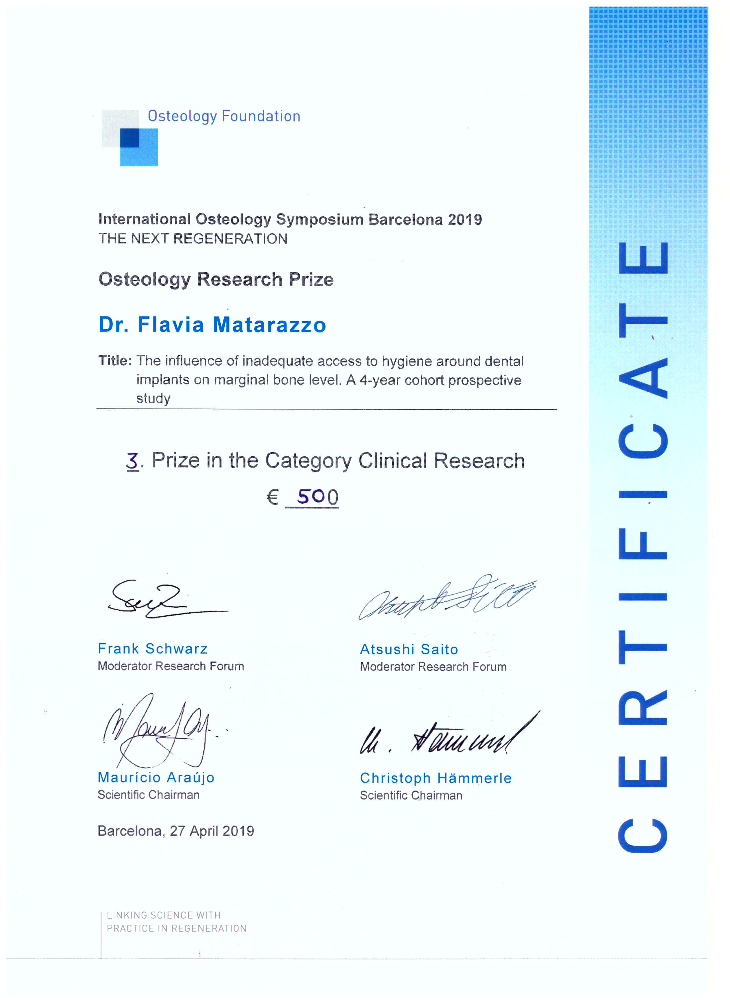
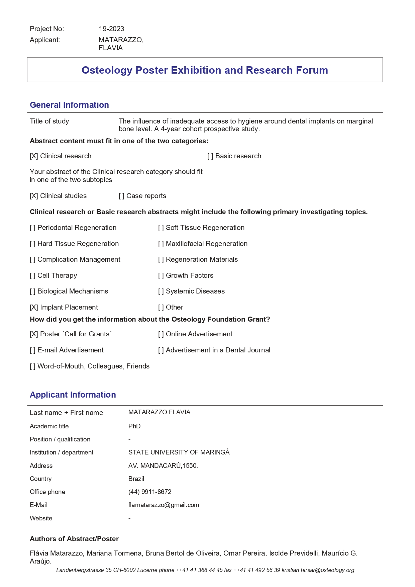
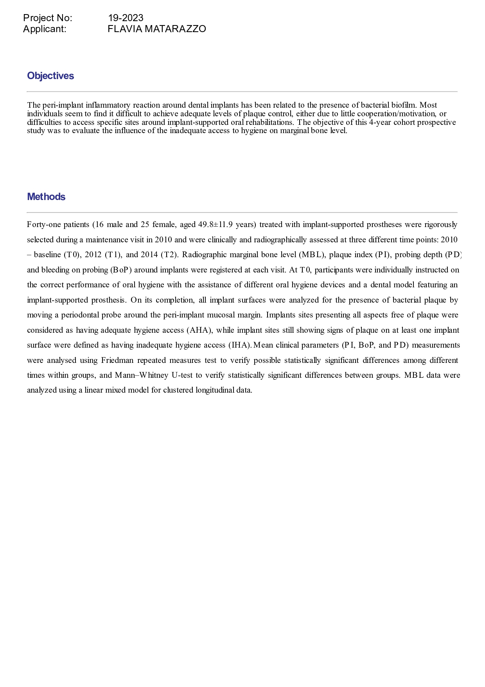
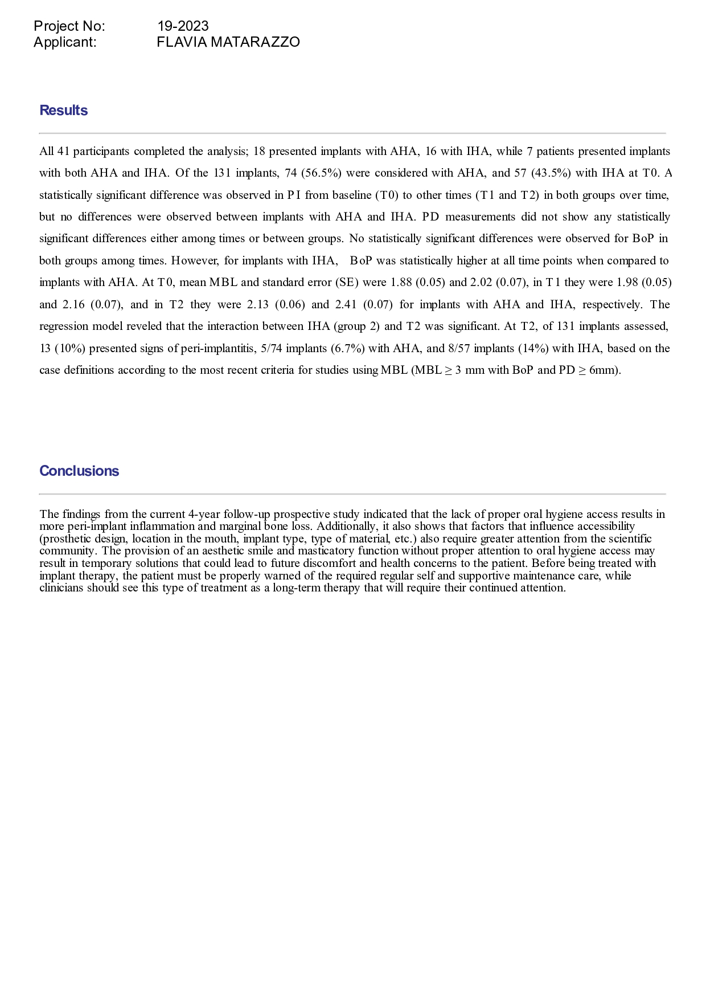

```{r setup , include=FALSE}
knitr::opts_chunk$set(echo = TRUE, 
                      size = "footnotesize",
                      comment = NA,
                      warning = FALSE,
                      message = FALSE,
                      fig.align = "center",
                      fig.width = 8, 
                      fig.height = 4, 
                      fig.show = "hold",
                      fig.path = "Figuras/",
                      fig.pos = "!htb",
                      background = "#E6E6FA",
                      dev = c("png",'pdf'),
                      res=300,
                      dpi = 300,
                      cache = TRUE)

```


[^1]: Apresentação do trabalho _The Influence of inadequate access to hygiene around dental implants on marginal bone level. A 4-ar cohort prospective study_ em Barcelona por nossa parceira Flávia, rendeu o terceiro lugar na categoria Clinical Research e uma premiação de 500 euros. Caso encontre erros, queira fazer comentários, ou trocar uma ideia sobre o artigo, por favor, me escreva: omarcnpereiraead@gmail.com

# International Osteology Symposium Barcelona 2019

A apresentação do trabalho _The Influence of inadequate access to hygiene around dental implants on marginal bone level. A 4-ar cohort prospective study_ no _International Osteology Symposium_ em Barcelona, 2019, por nossa parceira Flávia, rendeu o terceiro lugar na categoria Clinical Research e uma premiação de 500 euros. 


{width=100%} 
{width=100%} 
{width=100%} 
{width=100%} 