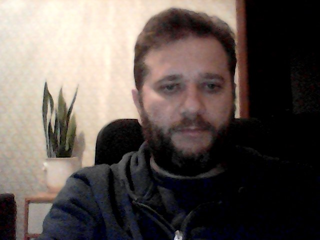
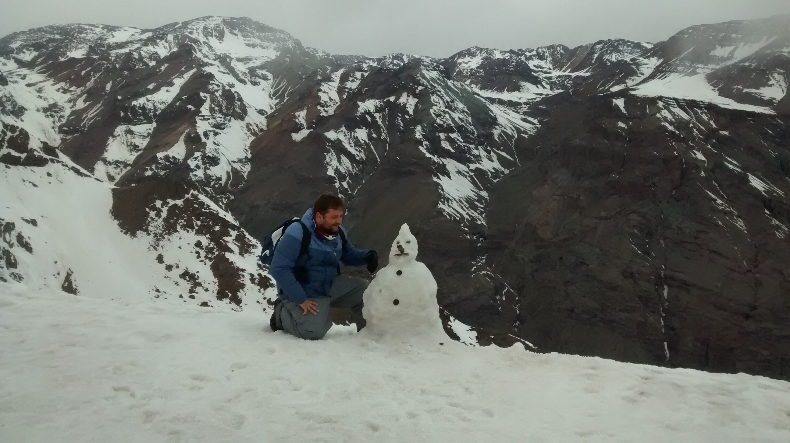

```{r setup , include=FALSE}
knitr::opts_chunk$set(echo = TRUE, 
                      size = "footnotesize",
                      comment = NA,
                      warning = FALSE,
                      message = FALSE,
                      #out.width = "1\\linewidth",
                      fig.align = "center",
                      fig.width = 8, 
                      fig.height = 4, 
                      fig.show = "hold",
                      fig.path = "Figuras/",
                      fig.pos = "!htb",
                      background = "#E6E6FA",
                      dev = c("png",'pdf'),
                      res=300,
                      dpi = 300,
                      cache = F)


```

```{r library, echo=FALSE,results='hide'}
library(nlme)
library(tinytex)
library(knitr)
library(kableExtra)
library(xtable)
```

```{r functions, echo=FALSE}
# A function to scale input to 0-1
scale_01 <- function(x){
  (x - min(x, na.rm = TRUE)) / diff(range(x, na.rm = TRUE))
}
```

```{r read-data, echo=FALSE}
# gapminder <- read_csv(here::here("data", "gapminder.csv"))
```


[{width=5%}](https://linkedin.com/in/omar-cléo-neves-pereira)
[{width=5%}](http://lattes.cnpq.br/9448206585707320)
[{width=5%}](https://github.com/OmarEAD)

<!-- Seja bem-vindo à minha página pessoal! -->

<!-- {width=80%}  -->
{width=100%} 

<span style="color:darkblue;font-weight:800;font-size:40px"> 
Olá, aqui é o Prof. Omar!
</span>

# Sejam bem-vindos! {-}

O desejo de trabalhar com agricultura surgiu desde criança, ao ver meu pai cultivando todos os dias em nossa horta caseira. Naquele pedacinho de terra, de aproximadamente de 25 metros quadrados, meu pai conseguia contribuir para a alimentação de nossa família, amigos e vizinhos. Isto foi muito motivador.

A agricultura brasileira tem se superado todos os anos e hoje alimenta grande parte do planeta. Este sucesso foi possível devido ao comprometimento das pessoas envolvidas neste processo, as quais se aperfeiçoaram de forma inter e multidisciplinares. A tecnologia empregada por meu pai já não seria suficiente hoje, mas o espírito, para servir ao maior número de pessoas, é o mesmo.

Minhas especialidades incluem a formação em Agronomia (graduação, mestrado e doutorado), Física (bacharelado e mestrado) e Bioestatística (pós-doutorado), áreas que também atuo como pesquisador e professor. Como resultado prático desta multidisciplinaridade, destaco o desenvolvimento de um equipamento para monitoramento da atividade iónica da solução do solo, patenteado pela Universidade Estadual de Maringá.

Também tenho como especialidade a programação em R, Latex (knitr), Markdown, e em outras linguagens, com as quais é possível gerar relatórios dinâmicos, além de apresentações e textos. Destaco ainda, minha competência na análise e ciência de dados e estatística, e, claro, meu entusiasmo em sempre estar disposto a aprender novas habilidades. Neste contexto me coloco a disposição para me envolver e atuar em novos projetos e desafios.